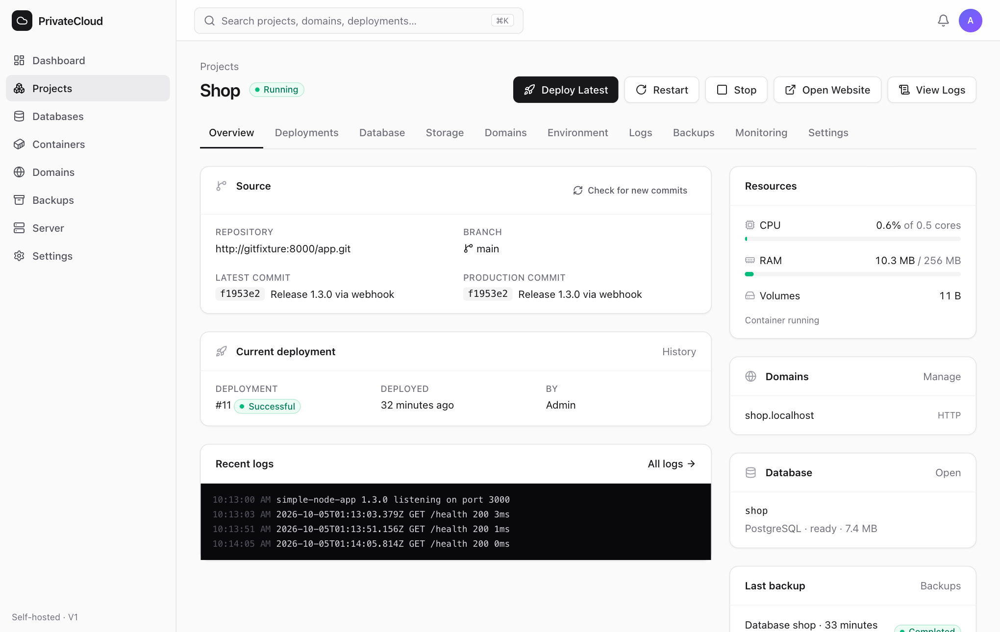
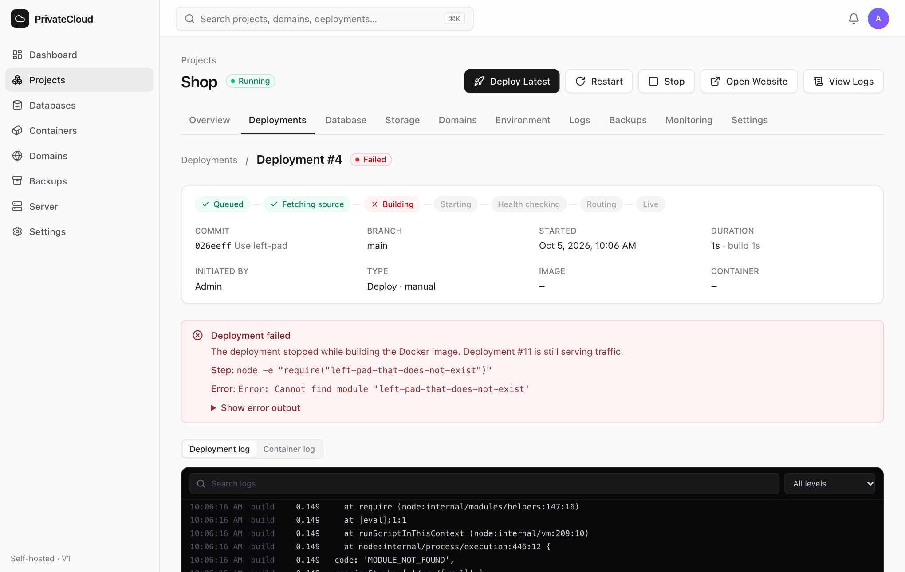
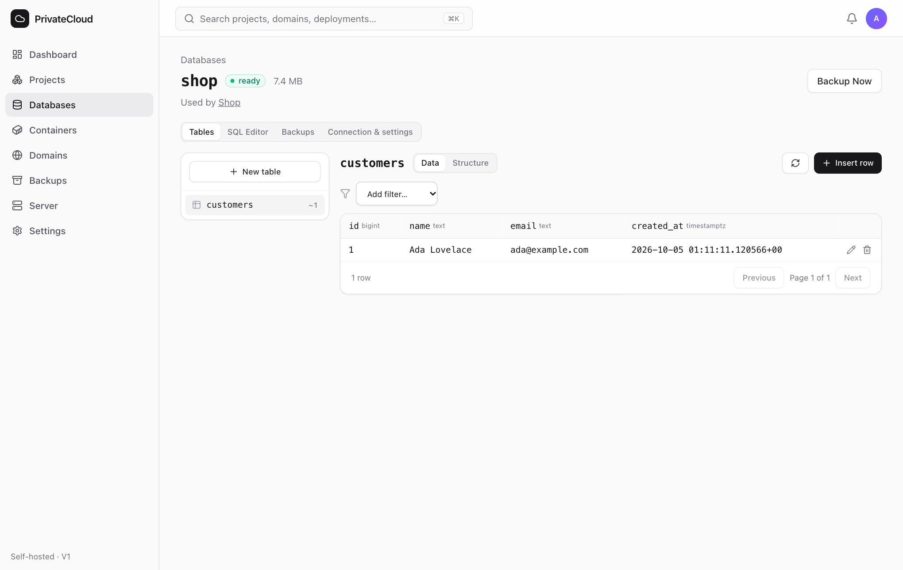
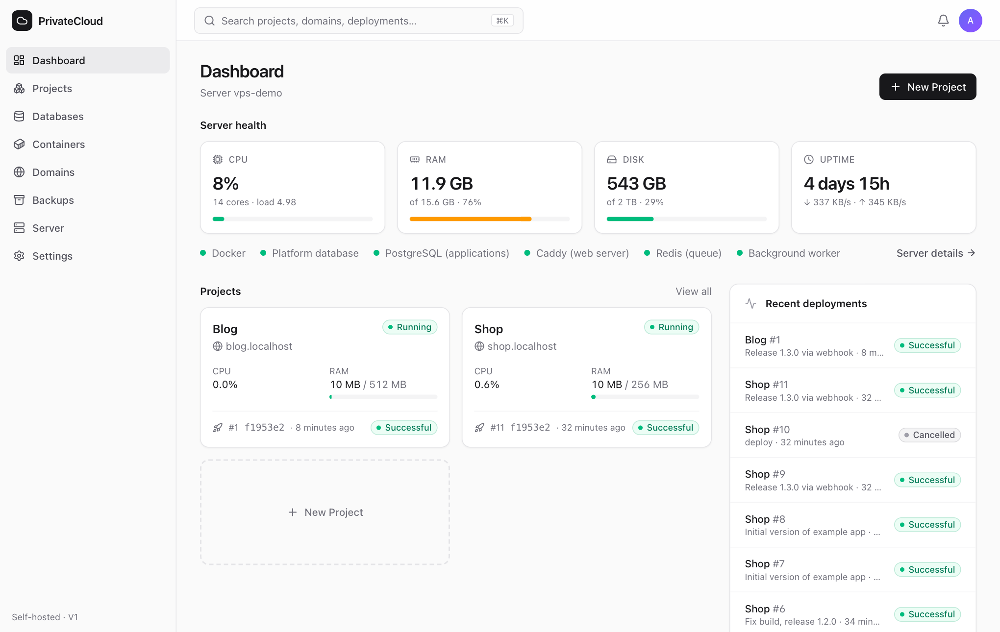
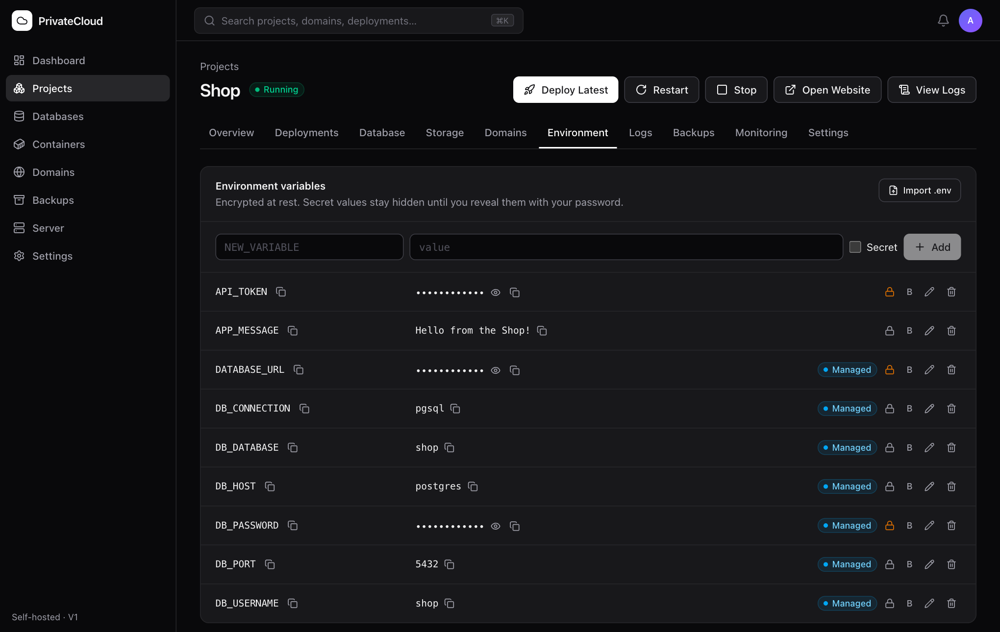

# PrivateCloud

[](https://github.com/Nayemuzzaman/Clouden/actions/workflows/ci.yml)

**Your own Railway/Vercel-style platform on a single VPS.** Install it once on a fresh
Ubuntu server, then deploy applications from GitHub, give them domains with automatic
HTTPS, create PostgreSQL databases, manage environment variables, read logs, take
backups and watch server health — from a web dashboard, without SSH.



```
Write code → git push → Deploy Latest → live (after a successful build and health check)
```

> **Status: V1 release candidate.** Fully tested automatically and with real Docker, but
> not yet validated on a real VPS. Run the [first server test](docs/first-server-test.md)
> before trusting it with important applications. See [Project status](#project-status).

**Contents:** [Features](#features) · [How it works](#how-it-works) ·
[Tech stack](#tech-stack) · [Requirements](#requirements) ·
[Installation](#installation) · [First login](#first-login) ·
[Create a project](#create-a-project) · [Connect GitHub](#connect-github) ·
[Domains](#domains) · [Databases](#databases) · [Backups](#backups-and-restore) ·
[Updating](#updating-privatecloud) · [Configuration](#configuration) ·
[Command-line reference](#command-line-reference) · [API](#api) ·
[Repository layout](#repository-layout) · [Documentation](#documentation) ·
[Security](#security-recommendations) · [Development](#development) · [CI/CD](#cicd) ·
[Project status](#project-status)

## Features

- **Projects** from a GitHub repository (public or private), any public git URL, or a
  Docker image. The Dockerfile is the deployment contract.
- **Safe deployments**: build → start next to the live version → health check → switch
  traffic → retire the old container. A failed build or health check never touches
  production. Live progress, full build logs, and a plain-language explanation of what
  failed ("Step: `npm run build` — Error: Module not found").
- **Rollback** to any recent successful deployment (images are retained), **redeploy**
  with new settings, **auto deploy** on `git push` via signed GitHub webhooks.
- **Domains & HTTPS**: Let's Encrypt certificates through Caddy, DNS checks with
  step-by-step instructions, certificate status.
- **PostgreSQL**: one isolated database and user per application, credentials injected as
  environment variables, a Supabase-style **table browser** (browse, filter, sort, insert,
  edit, delete rows; create tables; add/edit columns) and a **SQL editor** with
  destructive-query confirmation and history.
- **Environment variables** encrypted at rest; secrets masked and revealed only after
  re-entering your password; `.env` import.
- **Logs**: application output and web access logs with live tail, search, level filter
  and download.
- **Backups**: database dumps and volume archives, verified and checksummed before they
  count as completed; scheduled backups with retention; restore with an automatic safety
  backup first.
- **Monitoring**: CPU, RAM, disk, load, network, uptime, per-application usage and limits,
  service health, history charts, configurable warnings.
- **Containers**: start, stop, restart; memory/CPU/process limits per application.
- Audit log, in-dashboard notifications, ⌘K command palette, light and dark mode,
  responsive layout.

| | |
| --- | --- |
|  |  |
|  |  |

## How it works

```
Browser → Caddy (HTTPS) → Laravel API + React dashboard → Docker · PostgreSQL · Caddy · GitHub
                       ↘ your applications (one container + network per project)
```

Everything runs in Docker on your server: the control plane (Laravel 13 / PHP 8.4 API
with the React dashboard, queue workers, scheduler), PostgreSQL for PrivateCloud's own
data, a separate PostgreSQL server for your applications, Redis and Caddy. Only Caddy is
exposed (ports 80/443). Details: [docs/architecture.md](docs/architecture.md).

| Container | Role |
| --- | --- |
| `privatecloud-caddy` | Edge web server: TLS (Let's Encrypt), dashboard and project routing. The only container with published ports (80/443). |
| `privatecloud-app` | Laravel API + built React dashboard (FrankenPHP). Runs migrations on start. |
| `privatecloud-worker` | `deployments` queue: clone, build, start, health-check, route. One build at a time. |
| `privatecloud-tasks` | `default` queue: backups, restores, project deletion, domain checks. |
| `privatecloud-scheduler` | Periodic jobs: metrics, reconciliation, scheduled backups, certificate checks, pruning. |
| `privatecloud-platform-db` | PostgreSQL 17 for PrivateCloud's own data (projects, deployments, encrypted secrets, audit log). |
| `privatecloud-apps-db` | Separate PostgreSQL 17 for application databases (one role + database per app). |
| `privatecloud-redis` | Queues, cache, locks. |
| `pc-<project>-<n>` | Your application containers, one network per project. |

The deployment pipeline:

```
queued → cloning → building → starting → health_checking → routing → success
                                                                    ↘ failed / cancelled
```

The new container starts **next to** the live one; traffic switches only after it passed
its health check, and any failure leaves the live version untouched.

## Tech stack

| Layer | Technology |
| --- | --- |
| Backend | Laravel 13, PHP 8.4, FrankenPHP, Laravel queues on Redis, scheduler |
| Frontend | React 19, TypeScript (strict), Vite, Tailwind CSS 4, TanStack Query, React Router, Radix UI, CodeMirror (SQL), Recharts, cmdk, lucide icons |
| Data | PostgreSQL 17 (platform + applications), Redis 7 |
| Runtime | Docker Engine (HTTP API over the unix socket), BuildKit for builds, Caddy 2 with automatic HTTPS |
| Host | Ubuntu 24.04 LTS, `ufw`, systemd |
| Quality | PHPUnit (unit, feature, PostgreSQL integration), Larastan level 5, Pint, Vitest + Testing Library, oxlint, ShellCheck |

## Requirements

- A fresh **Ubuntu 24.04 LTS** server (tested target: Vultr Cloud Compute). 1 vCPU / 2 GB
  RAM works for small apps; 2 vCPU / 4 GB is comfortable. 25 GB+ disk.
- A domain for the dashboard, e.g. `cloud.example.com`, with an **A record** pointing to
  the server.
- Ports 22, 80 and 443 reachable.

## Installation

1. **Create the server** (Vultr: *Deploy → Cloud Compute → Ubuntu 24.04*), and add an
   `A` record `cloud.example.com → <server IP>` at your DNS provider.
2. **Clone and install** as root:

   ```bash
   ssh root@<server-ip>
   git clone https://github.com/Nayemuzzaman/Clouden.git /opt/privatecloud
   cd /opt/privatecloud
   ./scripts/install.sh --domain cloud.example.com --email you@example.com
   ```

   The installer:
   - refuses anything but Ubuntu 24.04 (x86_64/arm64, systemd), Docker older than 25,
     less than 5 GB free disk, ports 80/443 already in use, placeholder domains/emails;
   - installs Docker CE (log rotation, live-restore), enables `ufw` (deny incoming; SSH on
     every port sshd uses, 80, 443), adds 2 GB swap on servers with < 4 GB RAM;
   - generates `.env` with random secrets (root, mode 600; never printed). An existing
     `.env` is **never overwritten** — it is validated, and a development `.env` is
     refused;
   - builds and starts the stack (API, two queue workers, scheduler, Caddy, two
     PostgreSQL servers, Redis), installs a systemd unit and a nightly platform backup;
   - asks for the administrator password (or `--admin-password-file FILE` for unattended
     installs) and passes it on stdin;
   - finishes with `scripts/validate-install.sh`.

   It is safe to run again. `./scripts/install.sh --help` lists the options.

3. **Back up `/opt/privatecloud/.env` somewhere safe, off the server** (password manager
   or encrypted storage). It contains `APP_KEY`, which decrypts all stored secrets.
4. **Validate** at any time: `sudo ./scripts/validate-install.sh` (configuration, exposed
   ports, firewall, services, HTTPS certificate, backups).

## First login

Open `https://cloud.example.com` and sign in with the administrator account. There is no
public sign-up. Forgot the password?
`docker compose exec app php artisan privatecloud:admin --email=you@example.com --reset`

## Create a project

*Dashboard → New Project*:

1. **Source** — GitHub repository + branch, a git URL, or a Docker image.
2. **Domain** (optional) and **Create a PostgreSQL database** (optional).
3. **Environment variables** — add them or paste a `.env` file.
4. **Resources** — RAM limit, CPU limit, application port, health check path.

Click **Create Project**, then **Deploy now**. The dashboard follows the real state:
*Queued → Fetching source → Building → Starting → Health checking → Routing →
Successful*.

Your application needs a Dockerfile and must listen on `0.0.0.0:$PORT`. Starter
Dockerfiles for Node.js, Next.js, React, Laravel and Python:
[docs/deployment.md](docs/deployment.md#starter-dockerfiles).

## Connect GitHub

Public repositories deploy without a token. For private repositories and automatic
webhooks: *Settings → GitHub* → paste a fine-grained personal access token limited to
your repositories with *Metadata: Read*, *Contents: Read* and *Webhooks: Read and write*
— nothing else. It is stored encrypted and never returned to the browser.
See [docs/github.md](docs/github.md).

## Production branch → live

Each GitHub project links a **production branch** (default `main`) to the live site:

```
git push origin main → signed webhook → exact commit → docker build → new container
→ health check → Caddy switches traffic → live (the previous version is kept for rollback)
```

- Every deployment is pinned to an exact commit SHA when it is created. A broken commit
  never replaces a healthy version: the dashboard shows **Deployment failed** and the
  previous version keeps serving.
- The project page shows the head of the branch, the production commit and a status:
  **Synced**, **Out of sync**, **Deploying**, **Deployment failed** or **Unknown**, plus
  clear messages when the GitHub token, repository access or branch needs attention.
- **Deploy Latest** deploys the current head of the branch (or says production is already
  current and offers a redeploy). **Rollback** puts an earlier version back without
  touching GitHub; the commit you rolled back from is not redeployed automatically until
  a new push or Deploy Latest.
- One deployment per project at a time; rapid pushes deploy the newest commit; webhook
  deliveries are verified, deduplicated and ignored when out of order or for other
  branches and tags.
- **Redeploy** applies changed environment variables, volumes or limits. Databases and
  volumes are never touched by code deployments.

## Domains

*Project → Domains → Add Domain*. Point an A record at the server (the page shows the
exact record). HTTPS is issued automatically once DNS is correct; the status shows *DNS
not ready*, *HTTPS pending*, *HTTPS active* or the Let's Encrypt error.

## Databases

*Project → Database → Create PostgreSQL Database* (or *Databases → Create Database*).
`DB_HOST`, `DB_PORT`, `DB_DATABASE`, `DB_USERNAME`, `DB_PASSWORD` and `DATABASE_URL` are
added to the project's environment. *Open tables & SQL* gives you the table browser and
SQL editor. Databases are reachable only from inside the server.

## Environment variables

*Project → Environment*. Values are encrypted at rest; variables whose names look like
secrets are masked automatically. After changes, click **Redeploy** to apply them.

## Backups and restore

- **Backup Now** on a project or database; **Scheduled backups** in project settings.
- **Restore** asks you to type the database/volume name and confirm your password, takes a
  safety backup of the current data, then restores (databases restore in one transaction).
- Backups are stored on the server under `/var/lib/privatecloud/backups`. **Copy them off
  the server** — see [docs/backups.md](docs/backups.md) for rclone/rsync examples and
  disaster recovery, and back up PrivateCloud itself with `scripts/backup-platform.sh`.

## Updating PrivateCloud

```bash
cd /opt/privatecloud
sudo ./scripts/update.sh
```

The script refuses to run with local code changes, waits until no deployment, backup or
restore is running, takes a verified platform backup, builds the new version while the
old one keeps running, restarts the control plane (migrations run on start) and waits for
it to be healthy. If the build fails, nothing is restarted; if the new version is not
healthy, it stops with exact rollback instructions. Your applications keep running
throughout.

## Configuration

Settings live in `.env` (see [.env.example](.env.example)); defaults and descriptions are in
[backend/config/privatecloud.php](backend/config/privatecloud.php). Common ones:

| Variable | Default | Meaning |
| --- | --- | --- |
| `PC_DASHBOARD_DOMAIN` | — | Dashboard hostname |
| `PC_PUBLIC_IPV4` | detected | Server IP used for DNS checks |
| `PC_DATA_DIR` | `/var/lib/privatecloud` | Backups, routing files, builds |
| `PC_BUILD_TIMEOUT` | `1800` | Seconds before a build is aborted |
| `PC_MIN_FREE_DISK_MB` | `2048` | Free disk required to start a build |
| `PC_THRESHOLD_CPU` / `_MEMORY` / `_DISK` | `90` / `90` / `85` | Warning thresholds (%), also editable in Settings |
| `PC_METRICS_RETENTION_DAYS` | `3` | Metric history kept |
| `PC_PASSWORD_CONFIRM_MINUTES` | `15` | How long a password confirmation unlocks secrets |
| `PC_REMEMBER_DAYS` | `14` | Maximum lifetime of "remember me" |
| `PC_BACKUP_MIN_FREE_DISK_MB` | `1024` | Free disk that must remain after a backup |
| `PC_HISTORY_RETENTION_DAYS` / `PC_AUDIT_RETENTION_DAYS` | `90` / `365` | History pruning |

The control plane refuses to start with an unsafe production configuration (debug mode,
plain HTTP, insecure cookies, weak passwords, root user, placeholder domain or account);
the reason is in `docker logs privatecloud-app`.

## Command-line reference

Run from the installation directory (`/opt/privatecloud`).

**Scripts** (as root):

| Command | What it does |
| --- | --- |
| `scripts/install.sh --domain D --email E` | Install or re-validate the server (see `--help`). |
| `scripts/validate-install.sh` | Read-only PASS/WARN/FAIL check of configuration, exposed ports, firewall, services, HTTPS, backups. |
| `scripts/update.sh` | Safe update: wait for running work → platform backup → build → restart → health check. |
| `scripts/backup-platform.sh` | Verified dump of the platform database + copy of `.env` (nightly via cron). |
| `scripts/dev-setup.sh` | Local development `.env` (never for servers). |

**Artisan commands** (`docker compose exec app php artisan …`):

| Command | What it does |
| --- | --- |
| `privatecloud:admin --email=E [--reset \| --delete \| --check-exists]` | Create the administrator, reset the password (signs out every session), delete an account. Password from a prompt or `--password-stdin`. |
| `privatecloud:check-config` | Production configuration guard (runs automatically on start). |
| `privatecloud:health [--plain\|--json]` | Docker, both PostgreSQL servers, Caddy, Redis and worker health; non-zero exit if a service is down. |
| `privatecloud:idle` | Exit 0 when no deployment, backup or restore is running. |
| `privatecloud:reconcile` | Fail stale jobs, detect crashed apps, repair project networks, restore a production route that drifted from the recorded deployment (every minute). |
| `privatecloud:production-status [project] [--json]` | Compare branch head, recorded production, running container and Caddy route; non-zero exit on a mismatch. |
| `privatecloud:recover-interrupted deployments\|default` | Clean up work interrupted by a worker restart (runs on worker start). |
| `privatecloud:check-domains [--all]` | Re-check DNS and certificates. |
| `privatecloud:scheduled-backups` | Start due scheduled backups and apply retention. |
| `privatecloud:metrics [--prune]` | Record or prune metrics. |
| `privatecloud:prune-history` | Delete old build logs, notifications, operations, SQL history. |
| `privatecloud:cleanup` | Remove old build cache, dangling images, stale build directories. |
| `privatecloud:reprovision-databases` | Re-create application roles/databases from the platform records (disaster recovery). |

## API

The dashboard is a client of a versioned REST API under `/api/v1` (about 100 endpoints),
so everything you can do in the dashboard can be scripted with the same session:

| Area | Endpoints (examples) |
| --- | --- |
| Auth | `GET auth/csrf`, `POST auth/login`, `POST auth/logout`, `GET auth/me`, `POST auth/confirm-password`, `PUT auth/password` |
| Projects | `GET/POST projects`, `GET/PATCH/DELETE projects/{slug}`, `POST projects/{slug}/start\|stop\|restart\|refresh-commit`, `PUT projects/{slug}/auto-deploy`, `GET projects/{slug}/production`, `POST projects/{slug}/webhook/check` |
| Deployments | `GET/POST projects/{slug}/deployments` (Deploy Latest; `commit_sha` to deploy an exact commit, `force` to rebuild), `POST projects/{slug}/redeploy`, `GET …/deployments/{id}/logs`, `POST …/deployments/{id}/rollback\|cancel` |
| Environment | `GET/POST projects/{slug}/environment`, `POST …/environment/import`, `PUT/DELETE …/environment/{id}`, `POST …/environment/{id}/reveal` |
| Domains | `GET/POST projects/{slug}/domains`, `POST …/domains/{id}/check\|primary`, `DELETE …/domains/{id}` |
| Databases | `GET/POST databases`, `GET databases/{id}/tables`, `…/tables/{t}/rows` (CRUD), `POST databases/{id}/sql` |
| Backups | `GET/POST backups`, `POST backups/{id}/restore`, `GET backups/{id}/download` |
| Server | `GET containers`, `GET server/metrics`, `GET server/services`, `POST server/cleanup` |
| Settings | `GET settings`, `PUT settings/thresholds`, `POST/DELETE settings/github`, `POST settings/github/check`, `GET github/repositories` |
| Webhooks | `POST webhooks/github/{project-uuid}` (HMAC-signed, no session) |

All management endpoints require the administrator session and the `X-XSRF-TOKEN`
header; secret reveals, restores and downloads also require a recent password
confirmation (HTTP 423 otherwise). The full list is in
[backend/routes/api.php](backend/routes/api.php).

## Repository layout

```
backend/                 Laravel API (app/Services holds the engine)
  app/Services/          Deployment pipeline, Docker client, Caddy routing, databases,
                         backups, domains, GitHub, monitoring, environment, audit
  app/Console/Commands/  privatecloud:* commands
  tests/                 Unit, Feature and Integration (real PostgreSQL) tests
frontend/                React dashboard (src/pages, src/components, src/hooks)
docker/app/              Control-plane image (Dockerfile, entrypoint, FrankenPHP config)
infrastructure/          Edge Caddyfile, systemd unit
scripts/                 install, validate-install, update, backup-platform, dev-setup;
                         acceptance/ (real GitHub + server test tools)
examples/simple-node-app Example application with a Dockerfile and /health endpoint
docs/                    Architecture, deployment, security, backups, GitHub,
                         troubleshooting, development, first server test, CI/CD
.github/workflows/       CI (tests, analysis, smoke test) and Deploy (update.sh over SSH)
.github/ci/              Smoke test, GitHub flow test (+ local GitHub simulation), installer guards
docker-compose.yml       Production stack · docker-compose.dev.yml: local development
```

## Documentation

| Guide | Contents |
| --- | --- |
| [Architecture](docs/architecture.md) | Components, data model, pipeline, concurrency, worker recovery, networking and isolation, decisions |
| [Deploying applications](docs/deployment.md) | The Dockerfile contract, stages, rollback, build-time variables, limits, starter Dockerfiles |
| [Security](docs/security.md) | Exposure, Docker socket trust boundary, sessions, secrets, injection safety, webhooks |
| [Backups](docs/backups.md) | What is backed up, verification, restore, off-site copies, disaster recovery |
| [GitHub](docs/github.md) | Production branch → live, token permissions, public/private repositories, sync status, rollback, webhooks, failures |
| [Troubleshooting](docs/troubleshooting.md) | Sign-in, DNS/HTTPS, failed deployments by stage, queues, disk, memory |
| [Development](docs/development.md) | Local stack, tests, end-to-end and production-mode testing |
| [First server test](docs/first-server-test.md) | Ordered validation procedure for a fresh Vultr server |
| [GitHub acceptance test](docs/github-acceptance-test.md) | Real github.com + Vultr test of production branch → live, with the tools in `scripts/acceptance/` |
| [CI/CD](docs/ci-cd.md) | What CI checks on every pull request; deploying updates to your server |

The same guides are published in the [project wiki](https://github.com/Nayemuzzaman/Clouden/wiki).

## Troubleshooting

See [docs/troubleshooting.md](docs/troubleshooting.md) — sign-in, DNS/HTTPS, failed
deployments by stage, crashed apps, stuck queues, memory and disk.

## Security recommendations

Use SSH keys only, keep unattended upgrades on, use a strong unique password, keep backups
and `.env` off the server, use a fine-grained GitHub token, and update regularly.

**The Docker socket is a privileged trust boundary**: the control plane needs it to run
your applications, and access to it is equivalent to root on the server. It is never
exposed to applications or the network, and the control plane runs unprivileged with all
capabilities dropped — but whoever controls the administrator account or the control
plane controls the server. Details, and how PrivateCloud protects secrets, sessions,
commands and SQL: [docs/security.md](docs/security.md).

## Development

```bash
./scripts/dev-setup.sh                                                  # local .env (HTTP, dev mode)
docker compose -f docker-compose.yml -f docker-compose.dev.yml up -d --build
docker compose -f docker-compose.yml -f docker-compose.dev.yml exec app php artisan privatecloud:admin
open http://localhost:8088

cd backend && php artisan test && ./vendor/bin/phpstan analyse && ./vendor/bin/pint --test
cd frontend && npm test && npm run typecheck && npm run lint && npm run build
```

Integration tests against a real PostgreSQL server, the end-to-end procedure and a
production-mode test on your workstation: [docs/development.md](docs/development.md).
Commits follow `type: summary` (`feat`, `fix`, `test`, `docs`, `refactor`, `chore`).

## CI/CD

GitHub Actions ([docs/ci-cd.md](docs/ci-cd.md)):

- **CI** on every pull request and push to `main`: backend (Pint, Larastan, PHPUnit with
  a real PostgreSQL 17), frontend (lint, typecheck, tests, build), scripts (ShellCheck,
  installer guard rails in Ubuntu 24.04, compose validation), and a **production-mode
  smoke test** that starts the real stack, deploys the example app cloned from the branch
  on GitHub, kills the worker mid-deployment, takes backups and re-creates the control
  plane, and a **GitHub production branch → live** end-to-end test (real git pushes to a
  local GitHub simulation, real builds, containers, health checks and Caddy routing,
  public and private repositories).
- **Deploy** (manual, or automatic after green CI on `main` when `AUTO_DEPLOY=true`):
  runs `scripts/update.sh` on your server over SSH with a pinned host key and a deploy
  user that may only run that script.

## Project status

**V1 release candidate — not yet validated on a real server.** Treat the first
installation as a test (see [docs/first-server-test.md](docs/first-server-test.md)) and
do not move important applications to it until that test passes.

Verified automatically and locally:

- Backend: 158 automated tests (feature, unit, and integration against a real
  PostgreSQL 17 server, including a real `pg_dump`/`pg_restore` round trip and database
  isolation), Larastan level 5 with no errors, Pint. Frontend: 23 component/page tests,
  strict TypeScript. Scripts: ShellCheck; installer guard rails and the fresh-install
  path exercised in an Ubuntu 24.04 container with system tools stubbed.
- End to end with real Docker (Docker Desktop on macOS):
  - development stack: deploy, update under load with zero failed requests, failed
    build and failed health check keeping production running, rollback, logs, restart,
    table editing confirmed with `psql`, database and volume backup/restore, signed
    webhooks (valid, forged, duplicate), concurrent deploy requests, image-source
    projects, project deletion, browser-driven create → deploy;
  - **production mode** (production compose file, uid 33, all capabilities dropped,
    HTTPS via Caddy's internal CA on localhost): configuration guard, placeholder admin
    refused, Secure/HttpOnly/SameSite=Strict cookies, no CORS headers, `X-Forwarded-For`
    spoofing does not bypass login rate limits, unknown hosts get 404, git deployment,
    worker killed mid-deployment then recovered and unlocked, backups, full control-plane
    re-create with project networks repaired.

**Requires a real server** (not yet tested): `scripts/install.sh` end to end on Vultr,
`ufw` + Docker interaction, Let's Encrypt issuance and renewal, public DNS checks, the
GitHub API and webhooks against github.com (covered by tests with recorded responses),
reboot recovery, `update.sh` against a real remote.

**Known limitations (V1)**: one administrator; no MFA; one server and one installation
per Docker host; builds run one at a time and BuildKit builds have no memory limit (swap
and OOM priorities protect the databases); private repositories only from GitHub (personal
access token; GitHub App planned); public Docker images only; backups stored locally
(off-site copies via rclone/rsync; S3 storage planned); volume backups are taken while
the app runs; applications share the host kernel; IPv6 clients share one rate-limit
bucket (see [security](docs/security.md)).

**Not in V1 by design**: Kubernetes, teams/RBAC, billing, other cloud providers, multiple
git providers, CDN, autoscaling, serverless. The data model already references servers so
multi-node management can be added later ([architecture](docs/architecture.md#path-to-multiple-servers)).

## License

No license has been chosen yet; until a `LICENSE` file is added, all rights are reserved
by the author.
